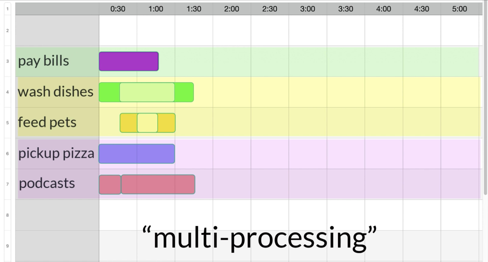
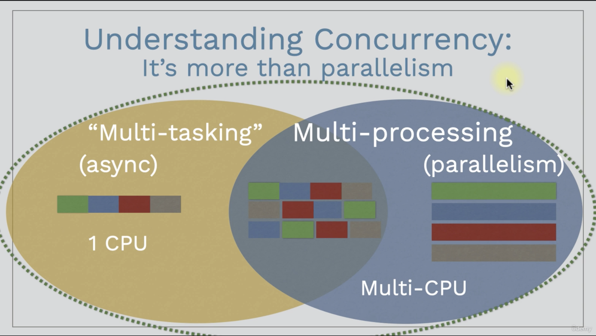
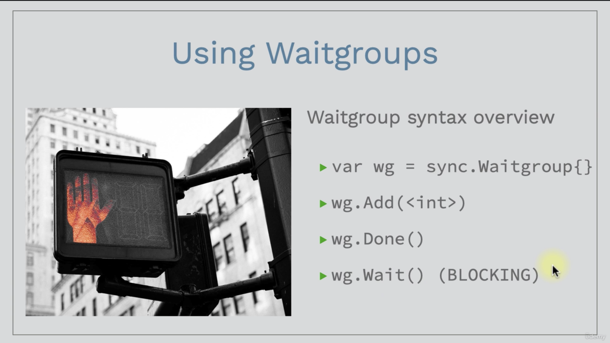
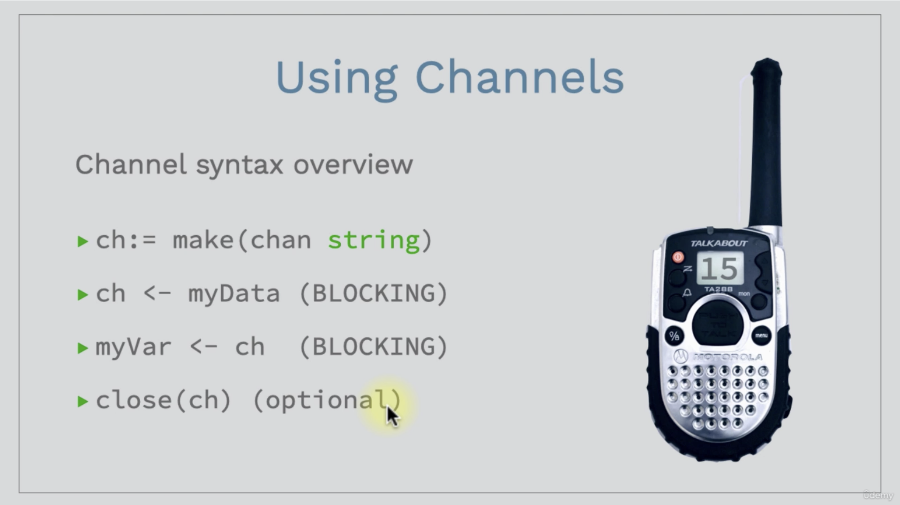
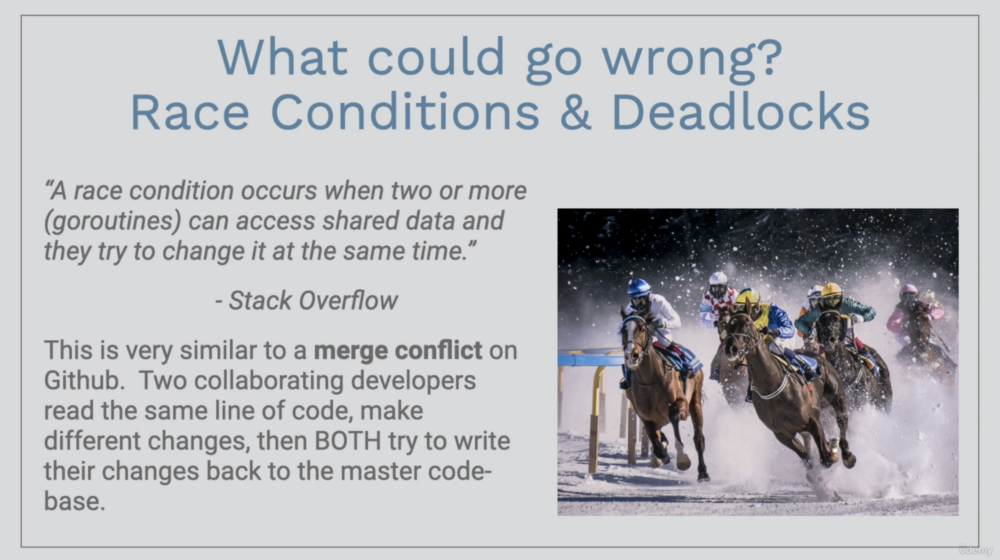
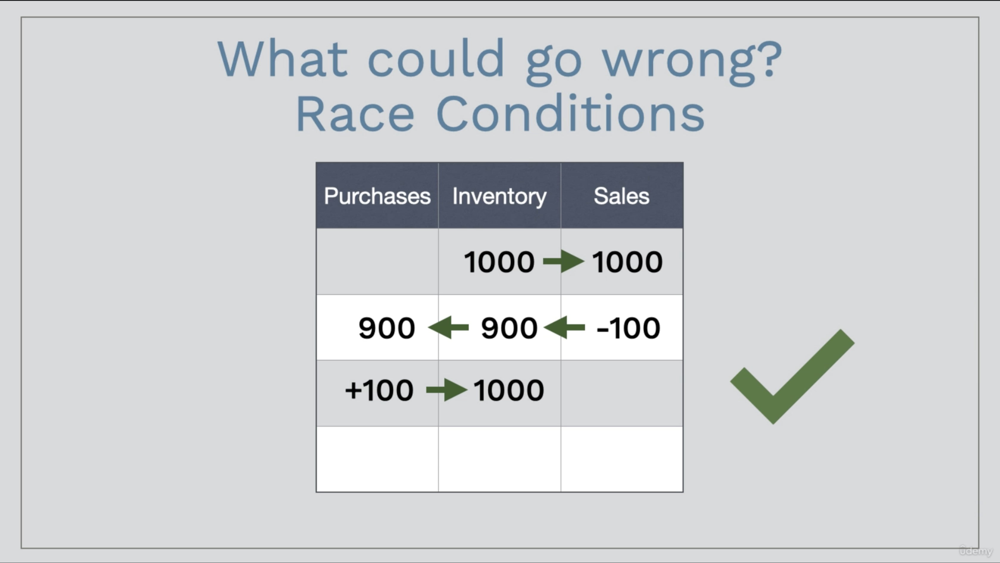
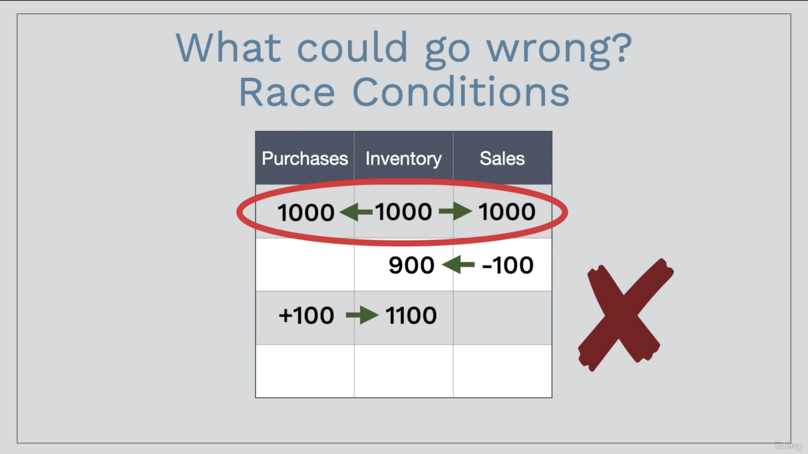

|                                                                                                                          	|                                                                                       	|                                                                                                                                             	|                                                                                         	|
|--------------------------------------------------------------------------------------------------------------------------	|---------------------------------------------------------------------------------------	|---------------------------------------------------------------------------------------------------------------------------------------------	|-----------------------------------------------------------------------------------------	|
| [Golang Concurrency](https://github.com/mwimam/golang-concurrency)                                                       	| [Latency](https://github.com/mwimam/golang-concurrency#latency)                       	| [Using waitgroups to track goroutines status](https://github.com/mwimam/golang-concurrency#goroutine)                                       	| [Race conditions & Mutex](https://github.com/mwimam/golang-concurrency#race-conditions) 	|
| [Why learn concurrency in go?](https://github.com/mwimam/golang-concurrency#why-learn-concurrency-in-go)                 	| [Multiple CPU cores](https://github.com/mwimam/golang-concurrency#multiple-cpu-cores) 	| [Using channels to communicate with goroutines](https://github.com/mwimam/golang-concurrency#using-channels-to-communicate-with-goroutines) 	| [Example](https://github.com/mwimam/golang-concurrency/tree/main/example)               	|
| [Understanding](https://github.com/mwimam/golang-concurrency#understanding-concurrency---trends-benefits-and-challenges) 	| [Goroutine](https://github.com/mwimam/golang-concurrency#goroutine)                   	| [IO-bounnd vs CPU-bound](https://github.com/mwimam/golang-concurrency#understanding-io-bounnd-vs-cpu-bound-processes)                       	|                                                                                         	|
|                                                                                                                          	|                                                                                       	|                                                                                                                                             	|                                                                                         	|

# Why learn concurrency in go?
- Improved performance (speed and scalability)
- Trends of increased latency and multicore CPUs create both a NEED FOR and OPPORTUNITY FOR concurrency
- Its what go was designed for.

# Understanding concurrency - trends, benefits and challenges
The potential for making progress on more than one task simultaneously or composition of independently executing processes is known as concurrency. Go has rich support for concurrency using goroutines and channels.




## Latency


## Multiple CPU cores


## Benefits and challenges
Benefits :
- Take advantages of latency in I/O-bound processes to improve performance on even a single processor
- Take advantages of multiple cores with CPU-bound processes for the fastest possible performance of your code on any hardware

Challenges :
- Not all code can be run concurrency
- Some additional complicatiob to write concurrency code
- Beware of intermittent bugs due to race conditions and other unexpected behavior

# Goroutine
A goroutine is a lightweight execution thread in the Go programming language and a function that executes concurrently with the rest of the program. Goroutines are incredibly cheap when compared to traditional threads as the overhead of creating a goroutine is very low.

Just add `go` in front of any functions and you are set!
> go doStuff()

# Understanding blocking code
- Blocking code does not allow its process to continue until blocking call finishes execution
- Blocking code does not allow its process to continue until blocking call finishes execution
- Blocking code allows execution to continue during waiting periods
- "blocking" code is like "normal" code in that it must complete before the process can continue
- Some goroutines can continue while others are blocked

Blocking code is generally used to :
- Force `func main()` to wait for other goroutines to complete (waitgroups)
- Synchronize goroutines at very specific points (channels)
- Prevent two goroutines from accessing a shared variable at the same time (mutexes, condition variables, atomic variables)

# Using waitgroups to track goroutines status


# Using channels to communicate with goroutines
Channels allow complex communication and synchronization between goroutines, inckuding `func main()`



# Understanding IO-bounnd vs CPU-bound processes
- I/O bound means the program is limited by I/O, or input/output, such as reading or writing to disk, network, etc
- CPU bound means the program is limited by the CPU, or central processing unit

Observations :
- Multiple cores dont help with sequential tasks
- Just one coree can see signficant speed improvements with concurrency in IO-bound code due latency
- CPU-bound code sees significant improvements up to the number of CPU cores. concurrency is no help with one core

|  | Sequential | IO-bound | CPU-bound |
| ------------- | ------------- | ------------- | ------------- |
| Single core | N/A | ✓ | N/A |
| Multi core | NO HELP | ✓ | ✓ |

# Race conditions




## Mutex syntax overview
```
mutex = sync.Mutex{}
mutex.Lock()
mutex.Unlock()
```

## Conditions variables syntax overview
```
var condition = sync.NewCond(&mutex)
condition.Signal()
condition.Broadcast()
condition.Wait() <-- blocking
```

## Atomic variables syntax overview
ex: 
> atomic.AddInt32(&inventory, 100)

same as :
```
mutex.Lock()
inventory += 100
mutex.Unlock()
```
